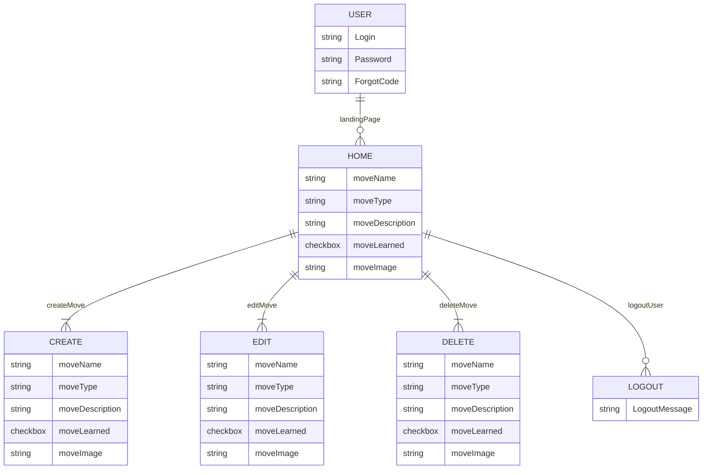

# **Brazilian Jiu Jitsu Moves**

## Webpage
[**LINK TO DEPLOYED WEBSITE**](https://move-matrix.onrender.com)

## Description
- User can create, view, edit, and delete list of Brazilian Jiu Jitsu positions, movements, and submissions

## Mock Up of UI

## List of Backend Endpoints
|Endpoint|Method|Purpose|
|--------|------|--------|
|/move|GET|List of moves|
|/move|POST|Create new moves|
|/move/:id|GET|JSON of moves with id|
|/move/:id|PUT|Update moves|
|/move/:id|DELETE|Delete moves|

## ERD Diagram

    

---
## Wireframe

## List of Technologies

