# **Jiu Jitsu Moves**

## Links
[**Deployed Site**](https://move-matrix.onrender.com)

[**Trello**](https://trello.com/b/mGwJpfU6/moveon)

## Screenshots

## Description
- User is able to view list of jiu jitsu moves including descriptions, point systems, and images.

## List of Backend Endpoints
|Endpoint|Method|Purpose|
|--------|------|--------|
|/move|GET|List of moves|
|/move|POST|Create new moves|
|/move/:id|GET|JSON of moves with id|
|/move/:id|PUT|Update moves|
|/move/:id|DELETE|Delete moves|
|/user/signup|POST|User signup|
|/user/login|POST|User login|
|/logout|GET|User logout|

## ERD Diagram

``` mermaid
erDiagram
    USER {
        string Login
        string Password
        string ForgotCode
    }

    USER ||--o{ HOME : landingPage

    HOME {
        string moveName
        string moveType
        string moveDescription
        checkbox moveLearned
        string moveImage
    }

    HOME ||--|{ CREATE : createMove
    CREATE {
        string moveName
        string moveType
        string moveDescription
        checkbox moveLearned
        string moveImage
    }

    HOME ||--|{ EDIT : editMove
    EDIT {
        string moveName
        string moveType
        string moveDescription
        checkbox moveLearned
        string moveImage
    }

    HOME ||--|{ DELETE : deleteMove
    DELETE {
        string moveName
        string moveType
        string moveDescription
        checkbox moveLearned
        string moveImage
    }

    HOME ||--o{ LOGOUT : logoutUser
    LOGOUT {
        string LogoutMessage
    }
```

## Mock Up of UI

## Daily Schedule
|Day|Task|
|---|----|
|1|Complete ERD and Trello to do list|
|2|Complete routes|
|3|Complete seedData|
|4|Create gif play on hover|
|5/6|Create OAuth|
|7|Remaining CSS Styling|

## List of Technologies

